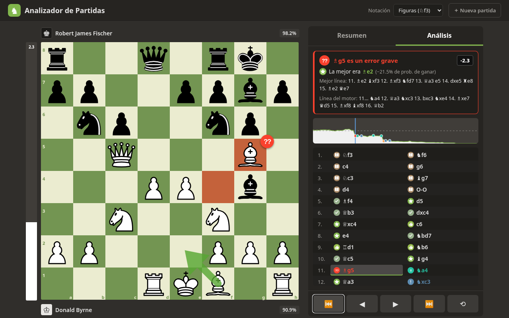
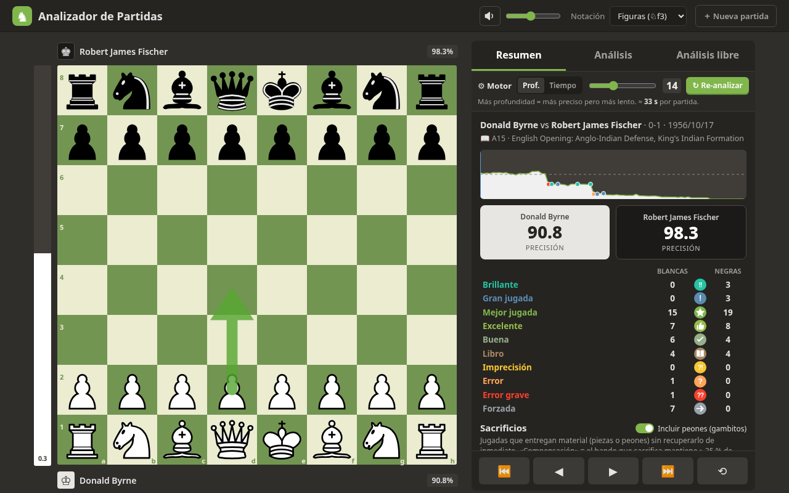
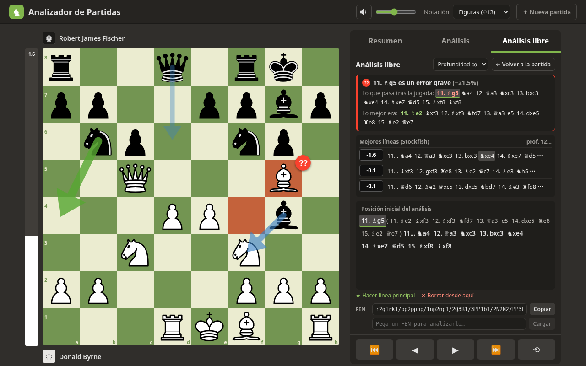
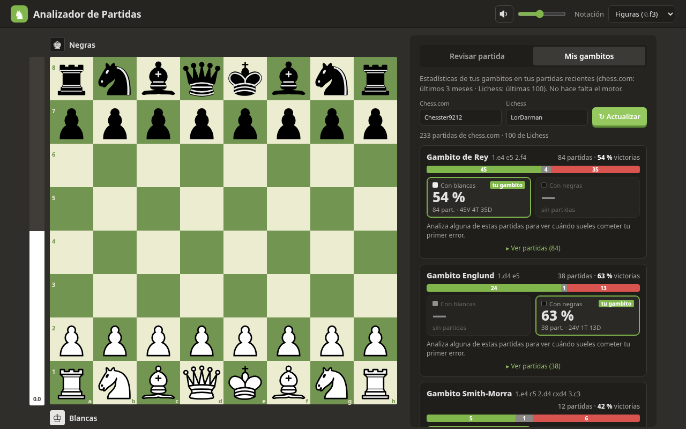

# ♞ Analizador de Partidas de Ajedrez

Aplicación web personal para revisar tus partidas al estilo de la "Revisión de partida" de chess.com.
Todo el análisis se hace **en tu navegador** con Stockfish 19 (WebAssembly): no hay servidor ni cuentas.

**▶ Pruébalo en línea: https://d4rm4n.github.io/analizador-ajedrez/**






## Qué hace

- Pega un PGN, sube un archivo `.pgn`, usa una partida de ejemplo o **importa tus partidas recientes**
  de **Chess.com** (usuario `Chesster9212` precargado) o **Lichess** (`LorDarman`).
- Stockfish analiza cada posición (profundidad configurable, 14 por defecto) y clasifica cada jugada:
  Brillante (!!), Gran jugada (!), Mejor jugada, Excelente, Buena, Libro, Imprecisión (?!), Error (?),
  Error grave (??) y Forzada.
- Tablero interactivo con flecha de la mejor jugada, barra de evaluación animada, lista de jugadas con iconos,
  gráfica de evaluación clicable, precisión por jugador, recuento de clasificaciones y una sección de
  **Sacrificios** (cuáles salieron bien y cuáles no).
- **Sacrificios y gambitos**: opción (activada por defecto) para contar también los peones entregados a propósito,
  gráfica de **balance de material**, "máximo material abajo" por jugador y si la **compensación se mantuvo**
  (el bando que sacrifica conserva ≥ 35 % de probabilidad de ganar durante las 5 jugadas siguientes).
- **Mis gambitos**: descarga tus partidas recientes (chess.com: últimos 3 meses · Lichess: últimas 100) y agrupa por gambito
  (Gambito de Rey, Englund, Smith-Morra, Alien, Evans, Evans invertido, otros gambitos y otras aperturas) usando
  las jugadas iniciales y el nombre ECO/Lichess de la apertura. Muestra partidas, V/T/D y **% de victorias con blancas
  y con negras**, la lista de partidas para abrirlas en el analizador y, para las partidas que ya analizaste
  (guardadas en el navegador), **en qué jugada suele llegar tu primer error**.
- **Análisis libre**: arrastra las piezas desde cualquier posición de la partida, desde la posición inicial o desde un FEN.
  Stockfish analiza en continuo (profundidad ∞ o hasta 16/20/24/30) y muestra las **3 mejores líneas** (MultiPV 3) con flechas.
  Tus jugadas forman un **árbol de variantes** (con subvariantes, "hacer línea principal" y "borrar desde aquí"),
  copiar/pegar FEN y diálogo de **coronación**.
- Botón **"¿Por qué es un error? · Analizar"** en cada jugada: abre el análisis libre en la posición anterior con
  la refutación de la jugada (lo que pasa después) y la mejor línea, ambas navegables.
- **Profundidad configurable** (10–22) o **tiempo por jugada** (0,25–10 s), con estimación del tiempo total y botón
  **Re-analizar**. Más profundidad = más preciso pero más lento.
- **Sonidos de madera** al avanzar jugadas y al mover piezas (jugada, captura, jaque, enroque, fin de partida, error),
  con botón de silencio y volumen. Los ajustes (sonido, volumen, profundidad, notación…) se guardan en el navegador.
- Navegación: botones o teclado (← → jugada anterior/siguiente, ↑/Inicio y ↓/Fin para ir al principio/final, **F** para girar el tablero).

## Ejecutarlo en tu computadora

Necesitas [Node.js](https://nodejs.org) 18 o superior.

```bash
npm install
npm run dev          # modo desarrollo en http://localhost:5173
# o bien, versión de producción:
npm run build
npx vite preview --host 0.0.0.0 --port 4173   # http://localhost:4173
```

### Usar solo el sitio ya compilado

Descarga el sitio compilado (se puede generar con `npm run build`, queda en `dist/`), y sirve la carpeta con cualquier servidor estático, por ejemplo:

```bash
cd dist
python3 -m http.server 8080      # luego abre http://localhost:8080
```

> No funciona abriendo `index.html` con doble clic (file://): el navegador bloquea el Web Worker del motor.
> Hace falta un servidor (aunque sea local).

### Publicarlo en internet

La carpeta `dist` es un sitio estático con rutas relativas: puedes subirla tal cual a **Netlify** (arrastrar y soltar),
**GitHub Pages** (este repositorio se publica solo con el flujo de GitHub Actions en `.github/workflows/deploy.yml` en cada push a `main`), Cloudflare Pages, Vercel, etc. No necesita cabeceras especiales (COOP/COEP) porque se usa la
versión de Stockfish de un solo hilo.

## Cómo se clasifican las jugadas

1. Cada evaluación en centipeones se convierte en **probabilidad de ganar** con la fórmula de Lichess:
   `50 + 50 · (2 / (1 + e^(−0.00368208 · cp)) − 1)`. Un mate cuenta como 100 % (o 0 %).
2. La **pérdida** de una jugada es la caída de probabilidad de ganar del bando que mueve respecto a la mejor jugada del motor.
3. Umbrales: mejor jugada (la del motor) · Excelente < 2 % · Buena < 5 % · Imprecisión < 10 % · Error < 20 % · Error grave ≥ 20 %.
4. **Gran jugada**: la mejor jugada cuando la segunda opción es al menos 15 % peor (era "la única buena").
5. **Brillante**: mejor jugada o casi (< 2 %) que **sacrifica material** (el rival puede ganar ≥ 2 puntos), sin estar ya
   totalmente ganado antes (< 90 %) y sin quedar perdiendo después.
6. **Libro**: jugadas iniciales que coinciden con el repertorio de aperturas abierto de Lichess (`lichess-org/chess-openings`).
   **Forzada**: solo había una jugada legal.
7. **Precisión**: cada jugada recibe `103.17 · e^(−0.0435 · pérdida) − 3.17`; la precisión de la partida combina la media
   ponderada por volatilidad y la media armónica (método de Lichess, muy similar al de chess.com).

## Sonidos

Los sonidos **no usan archivos de audio**: se sintetizan en el navegador con la Web Audio API
(ráfaga de ruido filtrada + resonancia grave corta que imita una pieza de madera sobre el tablero).
Son código propio de este proyecto, sin licencias de terceros.

## Tecnologías

React + TypeScript + Vite · [chess.js](https://github.com/jhlywa/chess.js) · [chessground](https://github.com/lichess-org/chessground) ·
[Stockfish.js 19](https://github.com/nmrugg/stockfish.js) (versión *lite single-threaded*, GPLv3) ·
datos de aperturas de [lichess-org/chess-openings](https://github.com/lichess-org/chess-openings) (CC0).

Pruebas de extremo a extremo: `node tests/e2e.mjs` (requiere el servidor en marcha en el puerto 4173 y Playwright;
`URL=https://d4rm4n.github.io/analizador-ajedrez/ node tests/e2e.mjs` para probar el sitio publicado).

## Limitaciones

- El motor "lite" es más débil que el Stockfish completo y la profundidad 14 es moderada: en posiciones muy tácticas
  alguna clasificación puede diferir de chess.com. Sube la profundidad (16–18) para más precisión (más lento).
- Brillante, Gran jugada y Sacrificios usan heurísticas propias (chess.com no publica su algoritmo exacto).
- Las importaciones dependen de las API públicas de Chess.com y Lichess (pueden limitar peticiones).
- Mientras se analiza la partida y a la vez se usa el análisis libre, ambos motores comparten la CPU (van más lentos).
- La detección de sacrificios es estática (capturas inmediatas): un peón que se deja colgar por descuido también aparece
  como "sacrificio", normalmente marcado como incorrecto.
